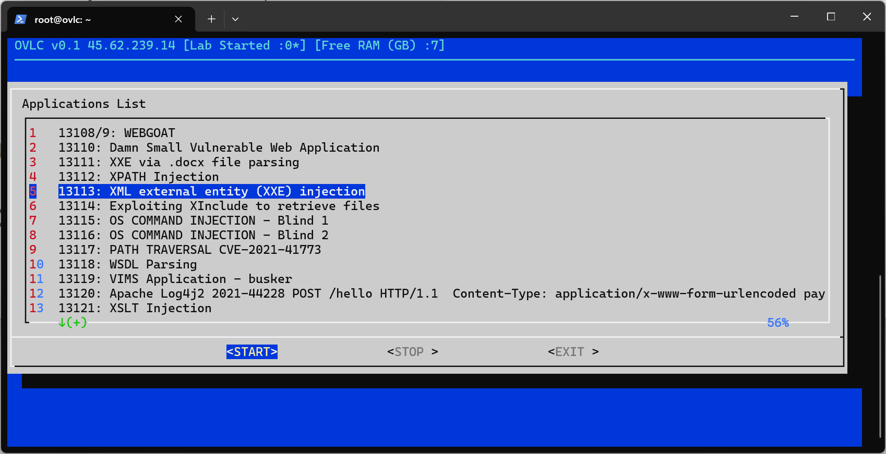
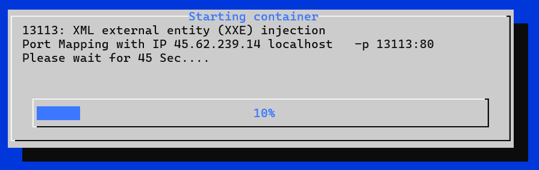

# OVLC (Open Source Vulnerable labs collections) 

OVLC is an open-source penetration testing lab collection that automates the process of downloading and installing dockers in Ubuntu servers.

Warning
----
>  This project should involve system configuration changes and the installation of multiple utilities such as dialog, Docker, etc. Additionally, it requires downloading multiple vulnerable labs. So, installing it on your primary working machine is not a good idea. Instead, **we suggest creating a separate virtual machine based on Ubuntu LTS and installing it there.** Installing it on your working machine, such as Kali Linux, may result in system breakage and potential availability issues.

Installation
----

Step 1: Install Ubuntu 22.04.3 LTS 

Step 2 : Switch to root user

Step 3 : git clone https://github.com/RavikumarRamesh/OVLC.git

Step 4 : bash setup.sh

Usage
----

Login to the machine and execute the command "ovlc"

Start the lab

Links
----
